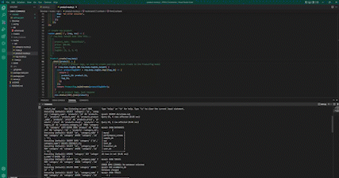

# ORM-ecommerce

## Table of Contents
   1. [License](#license)
   2. [Project-Description](#description)
   3. [Installation-Guide](#installation-guide)
   4. [Project-Usage](#usage)
   5. [Project-Contributors](#contributors)
   6. [Project-Tests](#tests)
   7. [Links](#links)
   8. [Mock-Ups](#mock-ups)
   9. [Questions](#questions-contact-me-at)
--- 
## [License](./LICENSE)

---
## Description 
    This project is an inventory database management system. A user is able to create new products with associated data. Track stock and update information as needed. 
---
## Installation-Guide
    This project seqeulize, dotenv, express and mysql2. Once in the main file folder, open your intergrated terminal in the same folder and execute the command `npm i` this will install all neccesary dependancies. Be sure to create your OWN '.env'. Then execute `mysql -u root -p` enter in your mysql password and then execute `SOURCE db/schema.sql` this will generate the ecommerce database. Next execute `USE ecommerce_db`. Then execute `exit`. Next execute command `npm run seed` this will generate basic database information that is fully changeable. Then execute `nodemon server.js` this will initialize a self restarting instance of your server. then utilzing insomnia or equivalent app, you can run the different request as needed.  
---
## Usage 
    This project is able to create, update, find all, fine one and delete a product, category, and tag for each!  
---
## Contributors
    n/a
---
## Tests
    n/a
---
## Links
https://vimeo.com/710171764/0555fe97a7 | https://github.com/remotemana/ORM-E-Commerce
---
## Mock-Ups
)
---
## Questions? Contact Me at...
lucas.e.roman@gmail.com | [github.com](https://github.com/remotemana)
